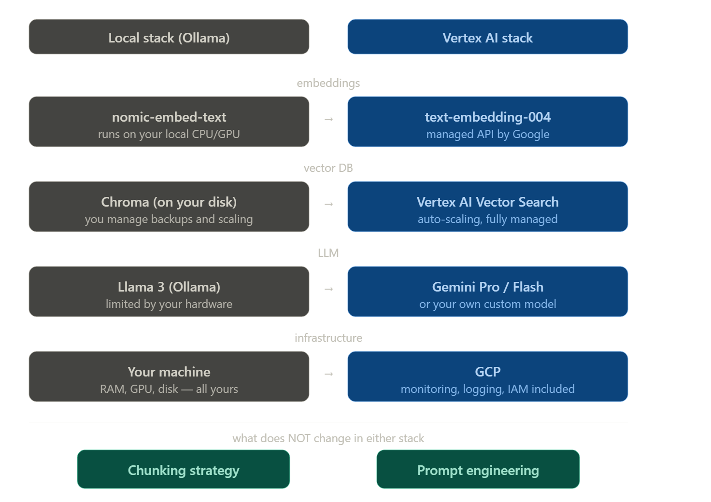
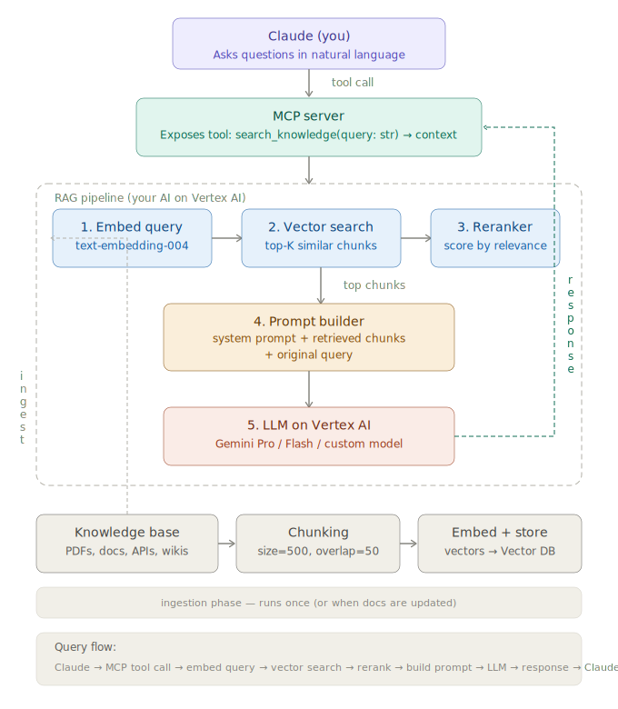
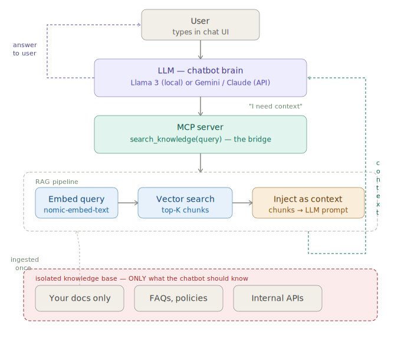
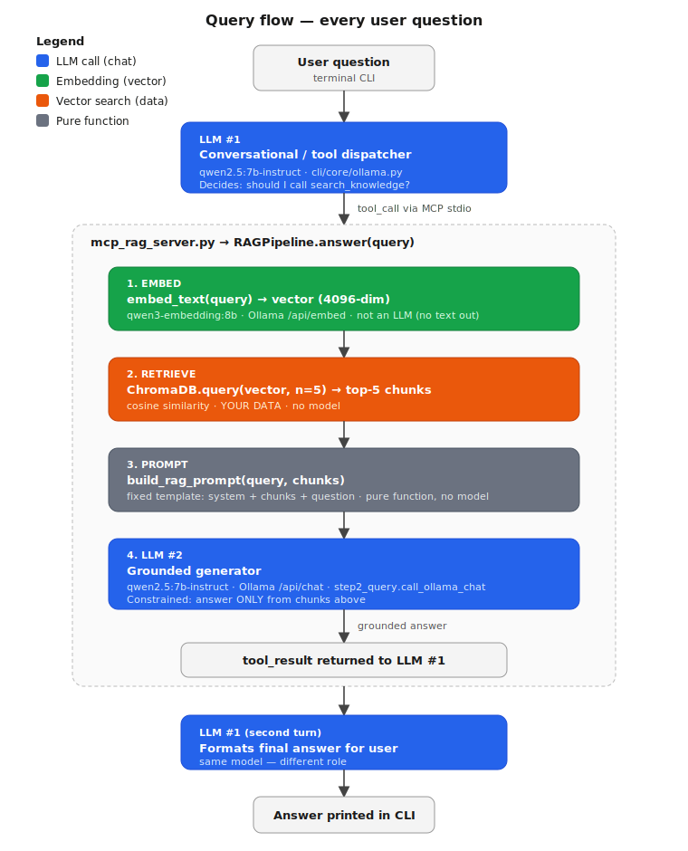
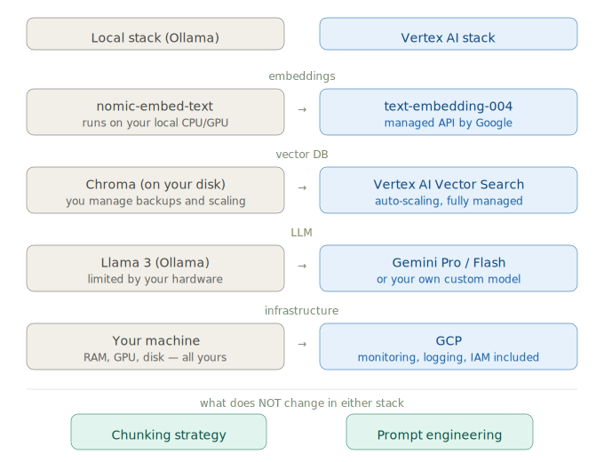

# RAG PoC — Local Stack (Ollama + ChromaDB + MCP)

Step-by-step Retrieval-Augmented Generation proof of concept. Runs **fully local**
on Ollama and ChromaDB, exposed to a terminal chat via MCP. The architecture is
designed so the migration to GCP Vertex AI is a **swap of components, not a rewrite**.

Knowledge base: internal coding standards (`docs/coding_standards.md`) and
engineering policy (`docs/engineering_policy.md`).



---

## 1. Architecture Overview





### Query flow (every user question)



A single user question triggers **three model invocations**, two of which are
LLM calls of the same model in different roles:

| # | Role                                              | Model                  | Where it runs                                      |
|---|---------------------------------------------------|------------------------|----------------------------------------------------|
| 1 | **LLM #1** — conversational / tool dispatcher     | `qwen2.5:7b-instruct`  | CLI: `cli/main.py` → `cli/core/ollama.py`          |
| 2 | **Embedding** — vectorizes query (and chunks)     | `qwen3-embedding:8b`   | RAG pipeline: `step1_ingestion.embed_text`         |
| 3 | **LLM #2** — grounded generator (answers from chunks only) | `qwen2.5:7b-instruct` | RAG pipeline: `step2_query.call_ollama_chat`       |

**LLM #1** decides *whether* to call `search_knowledge` and produces the final
answer the user sees. **LLM #2** is invoked inside the tool, constrained by the
RAG prompt template to answer **only** from the retrieved chunks. Same model
in this PoC for simplicity, but conceptually two separate roles — in Vertex AI
you might use Gemini Flash for #1 (fast tool routing) and Gemini Pro for #2
(stricter grounding). The **embedding model is not an LLM** — it produces
vectors, never text.

### Ingestion flow (runs once per KB version)

```
docs/  →  chunk_text(size=500, overlap=50)  →  embed_text  →  ChromaDB.upsert
```

---

## 2. RAG Type: Dense Retrieval

| Type        | How it works                  | Best for                                    |
|-------------|-------------------------------|---------------------------------------------|
| **Dense** ✅ | Vectors + semantic similarity | Meaning-based questions, paraphrases        |
| Sparse      | Keyword matching (BM25)       | Exact terms, codes, IDs                     |
| Hybrid      | Dense + Sparse combined       | Production systems, best recall + precision |

**Why Dense for this PoC:** asking *"How should I handle errors?"* still finds the
chunk that talks about *exception handling* — the model understands meaning,
not just keywords.

---

## 3. Embedding Model: `qwen3-embedding:8b` (Q4_K_M)

- **Not an LLM.** It produces vectors, never text — its only output is a list
  of 4096 floats representing semantic meaning.
- Dedicated embedding model — its **only** job is converting text into a 4096-dim vector.
- 8B parameters quantized to Q4_K_M: fits in **~5 GB VRAM**. Your 12 GB GPU has room
  for the chat LLM on top.
- State-of-the-art quality for English technical retrieval.
- **Do not** use the chat LLM (`qwen2.5:7b-instruct`) for embeddings — chat-tuned
  LLMs produce less precise semantic vectors because they were not trained for
  retrieval.

| Model                       | Dims | VRAM    | Notes                                |
|-----------------------------|------|---------|--------------------------------------|
| `qwen3-embedding:8b` Q4_K_M | 4096 | ~5 GB   | State-of-the-art ← **we use this**   |
| `bge-m3`                    | 1024 | 1.5 GB  | Strong, multilingual                 |
| `mxbai-embed-large`         | 1024 | 670 MB  | Good, English                        |
| `nomic-embed-text`          | 768  | 274 MB  | Baseline                             |

---

## 4. Local Stack vs Vertex AI



| Layer       | Local (this PoC)                     | GCP (next step)                   |
|-------------|--------------------------------------|-----------------------------------|
| Embeddings  | `qwen3-embedding:8b` (Ollama)        | `text-embedding-004` (Vertex AI)  |
| Vector DB   | ChromaDB on disk                     | Vertex AI Vector Search           |
| LLM         | `qwen2.5:7b-instruct` (Ollama)       | Gemini Pro / Gemini Flash         |
| Infra       | Your machine                         | GCP (monitoring, IAM included)    |

**What does NOT change:** `chunk_text()`, `build_rag_prompt()`, the `RAGPipeline`
interface, and `mcp_rag_server.py`. The local→GCP swap only touches the
embedding and chat client implementations.

---

## 5. Project Layout

```
RAG/
├── setup.sh              prerequisites: Ollama check, model pulls, deps
├── smoke_test.py         end-to-end pass/fail check
├── pyproject.toml        chromadb, httpx, mcp[cli], python-dotenv
├── .env                  OLLAMA_URL, EMBED_MODEL, CHAT_MODEL, COLLECTION_NAME
├── docs/                 knowledge base (coding standards + policy)
├── chroma_db/            auto-created on first ingest
├── ingest.py             versioned KB CLI (--docs / --list / --inspect / --delete)
├── step1_ingestion.py    educational: chunk + embed + store
├── step2_query.py        educational: embed query + search + LLM
├── step3_full_pipeline.py  RAGPipeline class (used everywhere)
├── mcp_rag_server.py     MCP server exposing search_knowledge
├── cli/                  terminal chat interface (moved from cli_project/)
└── visualizer/           TensorBoard Projector sub-project, Dockerized
```

---

## 6. Setup

```bash
# 0. Initialize git (one-time, from RAG/)
git init && git add . && git commit -m "chore: initial RAG project structure"

# 1. Prerequisites — pulls models if missing, installs deps for all sub-projects
bash setup.sh

# 2. Ingest documents into a named version
#    NOTE: ChromaDB requires collection names of 3-512 chars
#          ([a-zA-Z0-9._-], starting/ending alphanumeric).
uv run python ingest.py --docs ./docs --version v1-init
uv run python ingest.py --list

# 3. End-to-end check
uv run python smoke_test.py

# 4. (Optional) Visualize embeddings in TensorBoard Projector
#    Two ways — pick whichever you prefer:
#
#    Option A: Native (uv) — fastest, no Docker overhead
cd visualizer
uv sync
uv run python export_to_tensorboard.py        # writes tensorboard_data/<version>/
uv run tensorboard --logdir ./tensorboard_data --port 6006
# Open: http://localhost:6006/#projector
# (To switch version: uv run python export_to_tensorboard.py --version v2-... && refresh browser)
#
#    Option B: Docker
# cd visualizer && docker compose up --build
#
# Either way you should see two clusters: coding_standards.md vs engineering_policy.md

# 5. Standalone query (no chat UI)
cd ..
uv run python step2_query.py "How should I name my Python variables?"
uv run python step2_query.py "How do I create a hotfix branch?"

# 6. Interactive terminal chat with RAG attached
cd cli
uv run python main.py ../mcp_rag_server.py
# Try: "How should I handle errors in Python?" — the LLM calls search_knowledge
```

> If `COLLECTION_NAME` in `.env` is `knowledge_base`, your ingest version must
> also be `knowledge_base` (or change the env var to point at any other version
> like `v1-init`, `v2-add-security-policy`, etc.).

---

## 7. Versioned Knowledge Base

Each call to `ingest.py --version <name>` is a separate ChromaDB collection.
Multiple versions live side-by-side:

```bash
uv run python ingest.py --docs ./docs           --version v1-init
uv run python ingest.py --docs ./docs/security  --version v2-add-security-policy
uv run python ingest.py --list
uv run python ingest.py --inspect v1-init
uv run python ingest.py --delete v1-init
```

Switch which version the MCP server (and CLI chat) uses by setting
`COLLECTION_NAME=v2-add-security-policy` in `.env` before starting the server.

After a new ingest, refresh TensorBoard:

```bash
cd visualizer
bash refresh.sh v2-add-security-policy
```

---

## 8. End-to-End Data Flow

```
User in CLI: "How should I handle errors in Python?"
    │
    ▼
CliChat → Chat.run() → qwen2.5:7b-instruct receives tools=[search_knowledge]
    │
    ▼  LLM decides to call the tool
ToolManager → rag_client.call_tool("search_knowledge", {"query": "..."})
    │
    ▼  stdio pipe
mcp_rag_server.py → RAGPipeline.answer("...")
    │  1. embed_text(query)            → 4096-dim vector
    │  2. ChromaDB.query(vector, n=5)  → top chunks from coding_standards.md
    │  3. build_rag_prompt(query, chunks)
    │  4. call_ollama_chat(prompt, "qwen2.5:7b-instruct")
    ▼
"Always catch specific exceptions. Log with context (user_id, request_id).
 Never use bare except."
    │
    ▼  tool_result → second LLM call → final answer printed in CLI
```

---

## 9. MCP Inspector (visual debugger)

A small Dockerized subproject in `inspector/` wraps the official
[`@modelcontextprotocol/inspector`](https://github.com/modelcontextprotocol/inspector)
so you can click through tools, resources, and prompts of either MCP server in
a web UI — useful for verifying docstrings, calling tools with crafted inputs,
and watching request/response payloads without going through the CLI chat.

```bash
cd inspector

# Inspect the RAG knowledge base server (search_knowledge, rag://collection)
bash launch.sh rag

# Or the document MCP server (read_doc, edit_doc, docs://documents)
bash launch.sh docs

# Open: http://localhost:6274
```

Stops with `Ctrl+C`. Switch servers by stopping one profile and launching the
other — both bind to the same ports. See `inspector/README.md` for details.

---

## 10. Verification Checklist

- [ ] `bash setup.sh` finishes clean
- [ ] `uv run python ingest.py --docs ./docs --version knowledge_base` reports N chunks
- [ ] `uv run python ingest.py --list` shows the version
- [ ] `uv run python smoke_test.py` → all checks PASS
- [ ] `uv run python step2_query.py "How do I name variables?"` references coding_standards.md
- [ ] `uv run python step2_query.py "How do I create a hotfix?"` references engineering_policy.md
- [ ] Visualizer (native): `cd visualizer && uv sync && uv run python export_to_tensorboard.py && uv run tensorboard --logdir ./tensorboard_data --port 6006` opens at `localhost:6006/#projector`
- [ ] Visualizer (Docker, alternative): `cd visualizer && docker compose up --build`
- [ ] Two semantic clusters visible (coding standards vs engineering policy)
- [ ] `cd inspector && bash launch.sh rag` opens MCP Inspector UI at `localhost:6274` showing `search_knowledge`
- [ ] `cd inspector && bash launch.sh docs` shows `read_doc` and `edit_doc` with new docstrings
- [ ] `cd cli && uv run python main.py ../mcp_rag_server.py` starts CLI with both MCP servers
- [ ] Question in CLI → LLM calls `search_knowledge` → answer grounded in the docs
